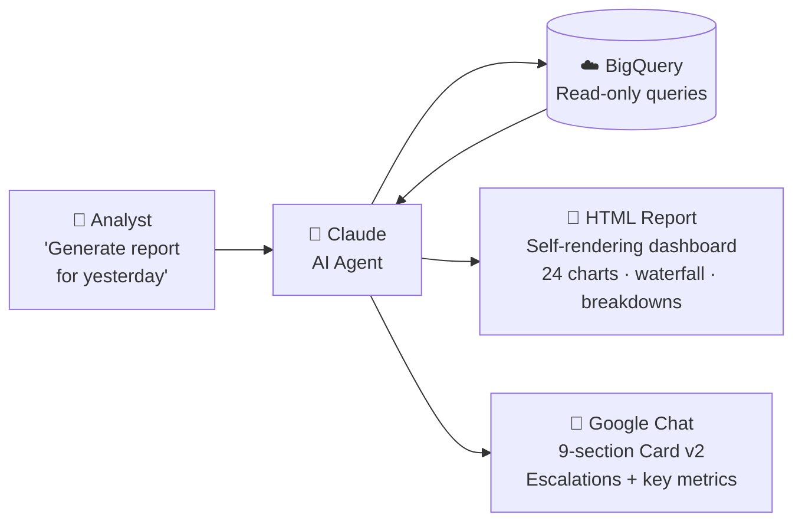
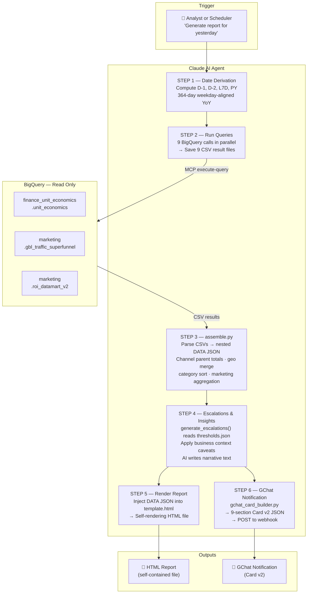
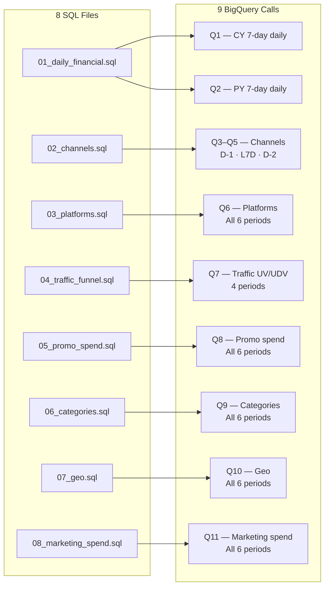
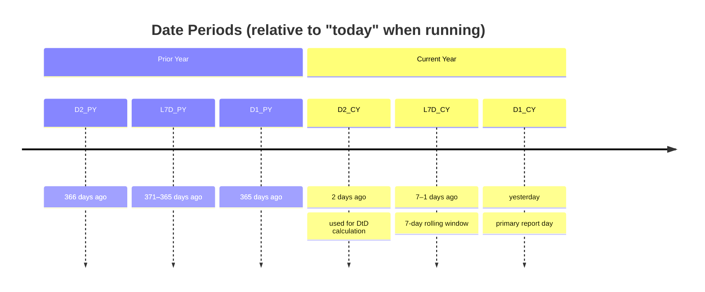
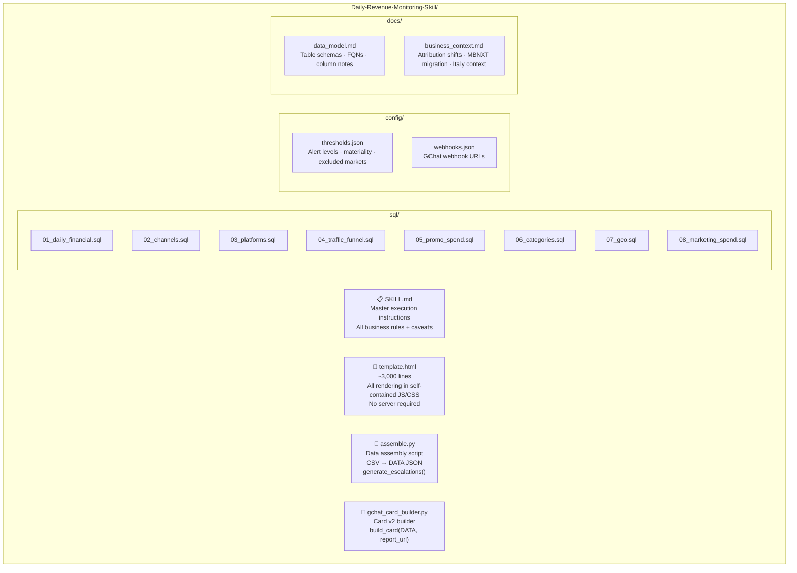
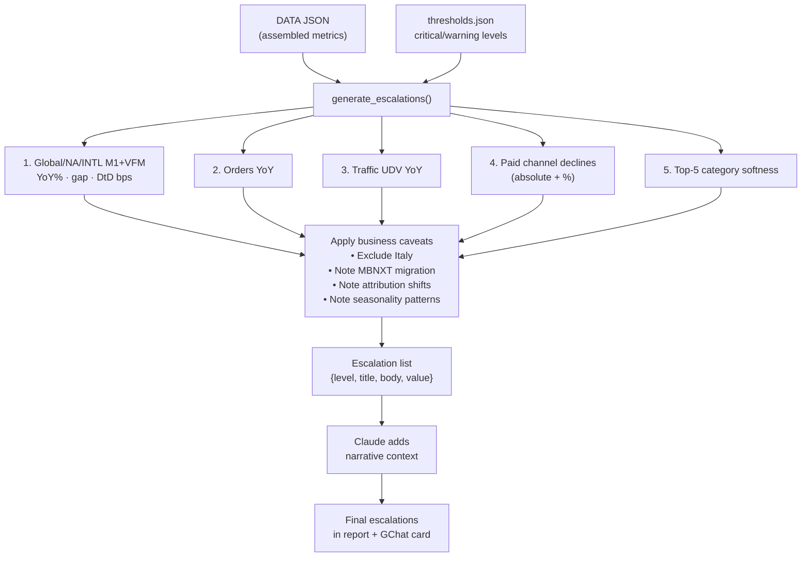

> **Note:** For security purposes, only the architecture overview is published here.
> The full skill (SQL queries, Python scripts, configuration, and HTML template) is available
> in the private repository:
> [groupon/ai_context_lab — skills and plugins/daily-revenue-monitor](https://github.com/groupon/ai_context_lab/tree/main/skills%20and%20plugins/daily-revenue-monitor)

---

# Daily Revenue Monitoring — Architecture Overview

> **Audience:** Technical leadership  
> **Purpose:** Explains how the Daily Revenue Monitoring skill works end-to-end — from data sources through AI orchestration to report output.

---

## What it is

An **AI-native reporting pipeline** that replaces a manual analyst workflow. Given a target date, Claude autonomously queries Groupon's data warehouse, assembles a structured report, renders a fully interactive HTML dashboard, and broadcasts a summary to Google Chat — all without touching any production infrastructure.

No dashboard server. No ETL schedule. No deployment. One command to a Claude conversation.

---

## High-Level Flow



---

## Full Execution Pipeline



---

## Data Sources

All three tables are queried **read-only** via BigQuery MCP — no service account, no write operations, no production system changes.

| Table | What it contains | Metrics derived |
|---|---|---|
| `finance_unit_economics.unit_economics` | Every order event with financials, FX rates, channel, platform, category, customer region | Orders · GB · GR · M1+VFM · Refunds · Promo · Channels · Platforms · Categories · Geo |
| `marketing.gbl_traffic_superfunnel` | Daily site traffic by country | Unique Visitors (UV) · Unique Deal Views (UDV) |
| `marketing.roi_datamart_v2` | Marketing spend by channel and date | SEM · Display · Affiliate costs → ROI · Contribution Profit |

---

## Query Structure: 8 SQL Files, 9 Calls, Q1–Q11 Labels

The SKILL.md refers to Q1–Q11 (11 logical "queries") but there are only **8 SQL files** and **9 actual BigQuery calls**. Some files are reused across different date ranges:



**Two execution styles exist across the 8 files:**

| Style | Files | How it works |
|---|---|---|
| `{{placeholder}}` dates | `01`, `02`, `03`, `05` | Claude substitutes exact dates computed in STEP 1. Works for any date. |
| `CURRENT_DATE()` | `04`, `06`, `07`, `08` | Self-contained, no substitution. Must run the day *after* the report date. For historical dates: replace `CURRENT_DATE()` with `DATE_ADD(DATE('YYYY-MM-DD'), INTERVAL 1 DAY)`. |

---

## Period Definitions

Every metric is computed across **6 time windows** to enable YoY and trend analysis:



**DtD (Day-over-Day change of YoY trend)** — the key diagnostic metric:

```
DtD (bps) = 10,000 × (YoY%_D1 − YoY%_D2)
```

A positive DtD means the YoY trend is *improving* day over day. A negative DtD means it's *deteriorating*. Expressed in basis points (1 bps = 0.01%) for precision.

**YoY alignment:** Prior year dates are always exactly **364 days** (52 weeks) before current year dates — ensuring the same day of week is compared (e.g., Sunday vs Sunday), removing weekly seasonality from the comparison.

---

## Skill Package Contents



---

## What Claude Does vs What Code Does

A deliberate separation of concerns: **Claude handles judgment, code handles computation.**

```mermaid
flowchart LR
    subgraph claude_does ["Claude handles"]
        J1["Business judgment\n'Is this decline worth escalating?'"]
        J2["Narrative writing\nEscalation titles + insight body text"]
        J3["Attribution context\n'SEM Brand up = SEO misattribution\nnot real SEM growth'"]
        J4["Orchestration\nDate math · query sequencing · file I/O"]
    end

    subgraph code_does ["Code handles"]
        C1["SQL aggregation\nBigQuery templates"]
        C2["Data assembly\nassemble.py\nParent totals · geo merge · sort"]
        C3["Threshold evaluation\ngenerate_escalations()\nReads thresholds.json"]
        C4["All rendering\ntemplate.html JS/CSS\nYoY% · DtD bps · color · charts"]
        C5["GChat card layout\ngchat_card_builder.py\n9 sections · wrapText"]
    end

    claude_does <-->|"DATA JSON\n(structured bridge)"| code_does
```



The **DATA JSON** is the handoff point — a fully structured ~50KB object that Claude populates and the HTML template consumes. Claude never formats a number or computes a percentage. The template JS handles all of that.

---

## The HTML Report: What's Inside

The output file is **fully self-contained** — no server, no refresh schedule, no login. Open it in any browser or email it directly.

| Section | Contents |
|---|---|
| **Financial Waterfall** | GB → GR → M1+VFM → Take Rate → Marketing Spend → Contribution Profit → ROI, for NA/INTL/Global |
| **Daily trend charts (×24)** | 7-day Chart.js line charts with CY vs PY overlays — one per metric per region |
| **Channels breakdown** | Direct · Paid Marketing (SEM Brand/PLA/Non-Brand · Display · Affiliate) · SEO · Managed Channel (Email/Push/SMS) · Other |
| **Platforms breakdown** | iPhone (incl. iPad) · Android · Touch · Web — with MBNXT migration context |
| **Categories breakdown** | 8 categories with sub-splits for TTD and HBW |
| **Geo breakdown** | INTL (Spain/DE/FR/GB/ROW) + NA (7 US regions) |
| **Marketing spend** | Paid channel costs with Contribution Profit and ROI |
| **Each table shows** | D-1 · D-1 YoY% · DtD (bps) · L7D · L7D YoY% |
| **Escalation panel** | AI-generated threshold-triggered warnings and criticals |
| **Insight cards** | Business context: attribution shifts, migration notes, seasonality |

---

## Escalation Logic

Escalations are generated programmatically by `generate_escalations()` in `assemble.py`, which reads thresholds from `config/thresholds.json`. Claude then adds narrative context.



**Threshold values (from `thresholds.json`):**

| Metric | Warning | Critical |
|---|---|---|
| M1+VFM YoY | < −10% or gap > $25K | < −15% or gap > $50K |
| M1+VFM DtD | < −100 bps | < −200 bps |
| Orders YoY | < −8% | < −20% |
| UDV YoY | < −10% | < −20% |
| Paid channel YoY | < −20% with gap > $10K | — |
| Category YoY (top 5) | < −10% | — |

---

## Why This Architecture

**Why an AI agent instead of a traditional ETL pipeline?**
The report requires business judgment: interpreting attribution shifts (Push→Direct reclassification, Managed Social→Free Referral fix, SEO/SEM Brand misattribution), flagging anomalies in context, and writing escalation narratives. A static pipeline computes the numbers; it can't write *"SEM Non-Brand declined −14% YoY but this is partially explained by the MBNXT Web migration reducing trackable SEM traffic."* Claude handles that layer while all deterministic work lives in code.

**Why a self-rendering HTML template instead of a BI tool?**
Zero infrastructure — no dashboard server, no refresh schedules, no permissions. The report is a file. Opened by anyone, forwarded by email, archived. The full rendering logic lives in `template.html` and never needs regenerating when data changes.

**Why BigQuery MCP instead of a scheduled query job?**
The skill runs on-demand via Claude — it's a conversational trigger, not a cron job. MCP gives Claude direct authenticated read access to BigQuery without any intermediate API layer. Any analyst can trigger it at any time for any date from any Claude conversation.

**Why Python scripts (`assemble.py`, `gchat_card_builder.py`) instead of in-context assembly?**
Raw in-context assembly of the DATA JSON consumes 10–20K tokens per run (parsing 9 CSV result sets, computing parent totals, merging geo data, sorting categories). The Python scripts do the same work in ~1 second and return a single JSON string. This cuts execution time from ~20 minutes to ~5 minutes per report.